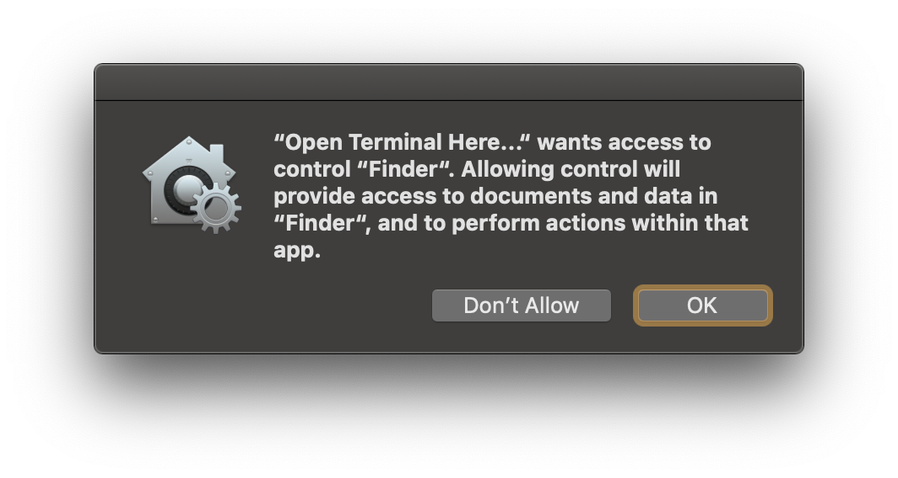
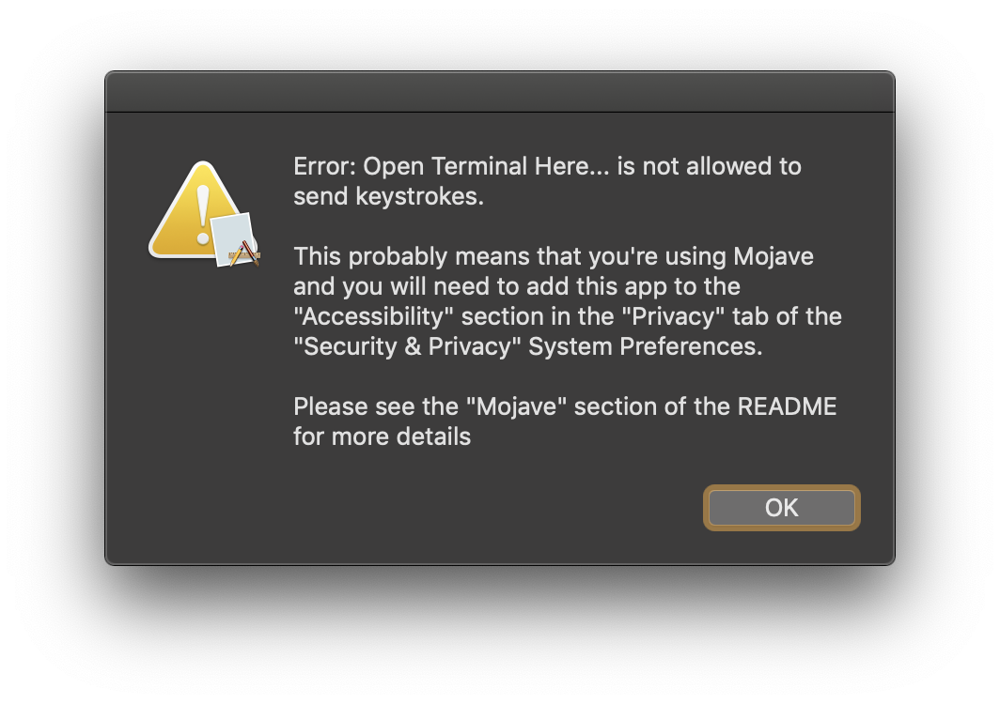
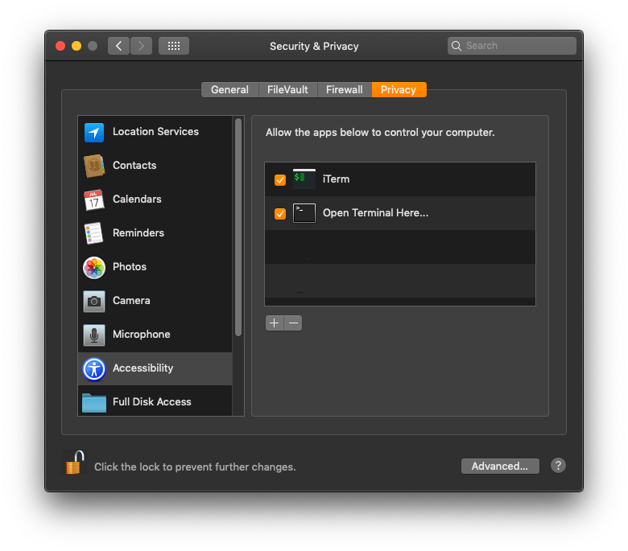

Using Mac OS X 10.14 Mojave or later?
=====================================

Mac OS X 10.14 Mojave made a lot of changes to OS X's security, including more restrictions on AppleScripts.

While more
security is good, Apple made it somewhat difficult to deal with.  You can find more technical details about the issue
and workaround in [Issue #1](https://github.com/rkanter/Open-iTerm-or-Terminal-Here.../issues/1#issuecomment-457107366).

For Terminal and iTerm
----------------------
The first time you run the app (either for iTerm or Terminal), you may see one or more messages like this:

Simply click "OK" and this shouldn't happen on subsequent launches.

For Terminal only
-----------------
For the Terminal app only, if Terminal is already running, you may see this message:

In that case, you'll need to add the "Open Terminal Here..." app to the "Accessibility" section in the "Privacy" tab of
the "Security & Privacy" System Preferences.  This is required because the app simulates pressing cmd+t to open a new
tab in Terminal.  Here's what that looks like:

Make sure the checkbox is selected.
