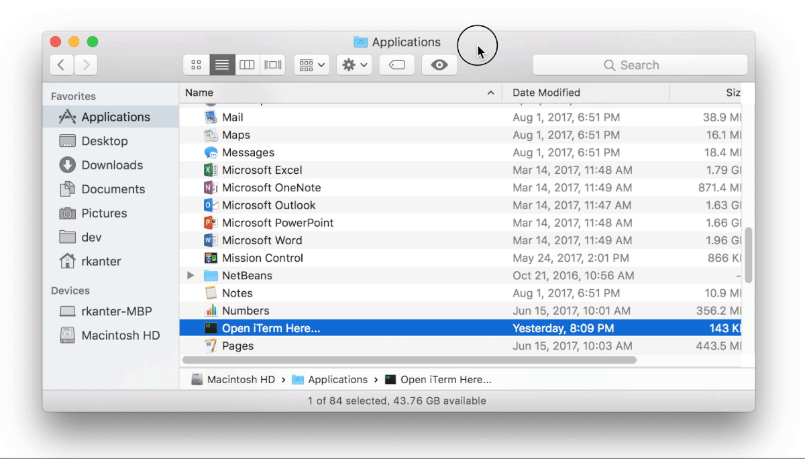

Open iTerm or Terminal Here...
==============================

This project generates an Applescript-based app that you can put in your Finder 
toolbar which will open an iTerm or Terminal tab at the current directory.

TODO: screenshot of finder toolbar (one for each iTerm and Terminal?)

Prerequisites
-------------
- If using iTerm, requires at least version TODO, and it should be installed 
- Tested on Mac OS X Sierra (10.12), but should likely work on earlier versions

Setup
-----

1. Generate the "Open iTerm Here..." or "Open Terminal Here..." app.  
It will show up in your Applications folder (``/Applications``).
````bash
./generate.sh [iterm|terminal]
````
For example:
````bash
$ ./generate.sh iterm
Preparing to generate 'Open iTerm Here...' app
Putting AppleScript into place
Setting the icon
Reticulating splines
Opening app location in Finder
Done
````

2. Click and drag the app into the toolbar area where you want it.  On newer
versions of OS X, you have to hold down the Command (⌘) key until a green plus 
sign (+) appears.

(This shows the process for the "Open iTerm Here..." app, 
but it's the same for the "Open Terminal Here..." app)
